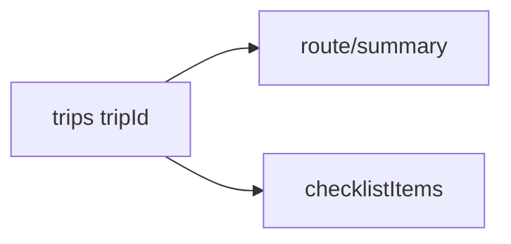

# TripSync Phase 2 — Build plan

This document tracks **Phase 2: Trip Planning and Personalization** from [phase-2-prd.md](./phase-2-prd.md), implemented on top of the MVP described in [initial-prd.md](./initial-prd.md) and [build-plan.md](./build-plan.md).

## Architecture

- **Stack unchanged:** Next.js (App Router), Firebase Auth (Google), Firestore, Firebase Storage. Phase 2 does **not** add a separate REST CRUD layer; data access matches Phase 1 (client SDK + security rules), except where the MVP already used Admin (e.g. join).
- **Trip document** extended with optional `coverImageUrl`, `backgroundImageUrl`, `startDate`, `endDate` (legacy `date` is still read in [firestore-map.ts](../src/lib/firestore-map.ts) as `startDate`).
- **Route:** single document at `trips/{tripId}/route/summary` with manual fields and ordered `stops`.
- **Checklist:** `trips/{tripId}/checklistItems/{itemId}`.
- **Trip UI:** tabbed dashboard ([TripDetail](../src/components/trip/TripDetail.tsx)): Overview, Expenses, Photos, Route, Checklist, Members; timeline and invite stay on Overview.



## Environment and deploy

Same as Phase 1. Copy [.env.local.example](../.env.local.example) to `.env.local`. After changing rules:

```bash
firebase deploy --only firestore:rules,storage
```

## Phase 2 checklist

- [x] Types and Firestore mappers for new trip fields, route, checklist items
- [x] Firestore rules for `route` and `checklistItems` subcollections; relaxed trip `create` required keys
- [x] Checklist UI with categories, assignees, progress, and completion toggle
- [x] Cover and background image upload to Storage; URLs on trip; dashboard cards show cover thumbnail; trip header and optional dashboard background
- [x] Home page: hero, feature grid, how-it-works, footer CTAs
- [x] Login page: split layout (benefits + form) without remote fonts
- [x] Route panel: manual start, destination, stops, distance/duration text, notes
- [x] Trip page tabs and Overview section (images, invite, balance snapshot, timeline)

## Current focus

Phase 2 deliverables are implemented in the app codebase. Remaining work is operational: deploy updated rules, verify uploads and multi-user access in your Firebase project.
